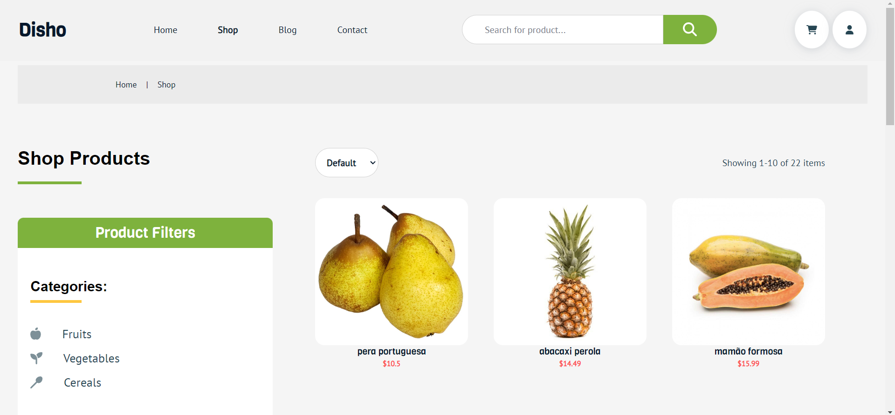
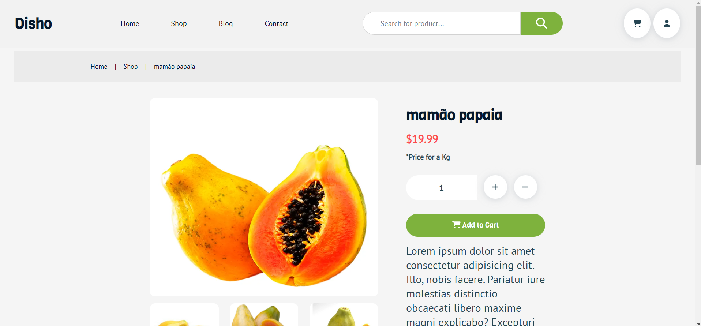
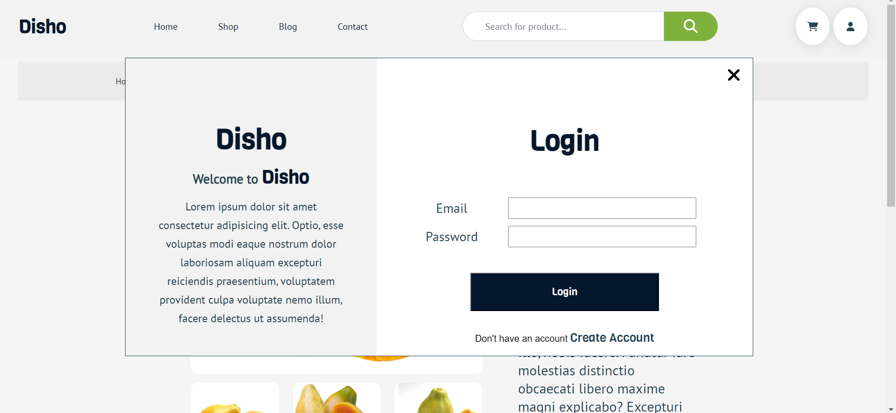
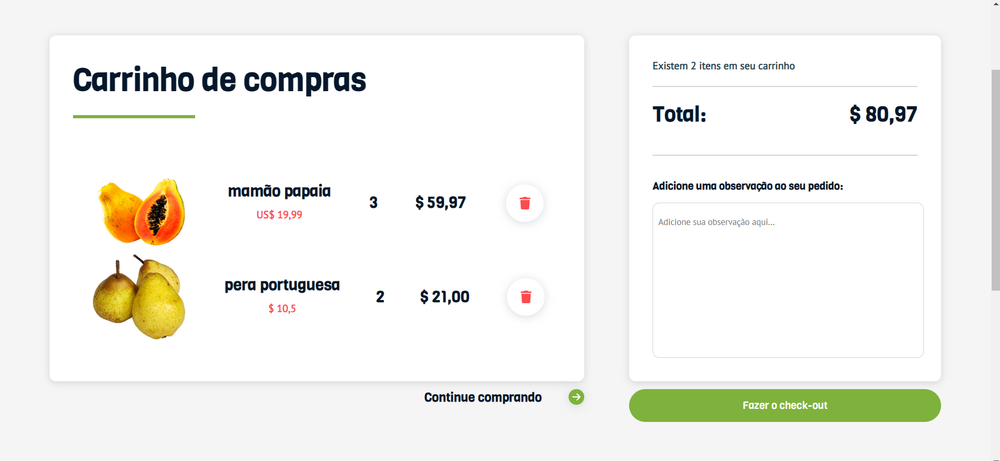

# E-commerce Disho

E-commerce de Hortifruti

## 🚀 Começando...

Essas instruções permitirão que você obtenha uma cópia do projeto em operação em sua máquina local para fins de análise e avaliação.

### 📋 Pré-requisitos

```
Tenha o NodeJS instalado em sua máquina
```

```
Tenha uma IDE para a visualização do código
```

### 🔧 Instalação

Faça um clone do repositório através do GitHub.

Após isso abra a IDE de sua preferência e navegue até a pasta **_disho_**.
Pode fazer isso abrindo o terminal e executando o comando

```
cd disho
```

Dentro da pasta **_disho_** execute o comando

```
npm install
```

Para que baixar todas as dependências do projeto

E então execute o comando

```
npm run serve
```

E o projeto será aberto localmente na sua máquina no endereço

```
http://localhost:8080
```

## 📦 Produção

Veja o projeto em funcionamento. [Disho e-commerce](https://disho-ecommerce.vercel.app/)

## :computer: Back-end

O Back-end do projeto está nesse repositório [Repositório Back-end](https://github.com/FelipeMacedo315/backendFruits)

## :clapper: Imagens



## **\_\_\_\_**



## **\_\_\_\_**



## **\_\_\_\_**



## 🛠️ Construído com

<div
 style="display:flex;
 justify-Content:space-evenly;
 align-items:center">
 </img> Javascript
 </img> Vue.JS
 </img> Css
 </img> Scss

</div>
